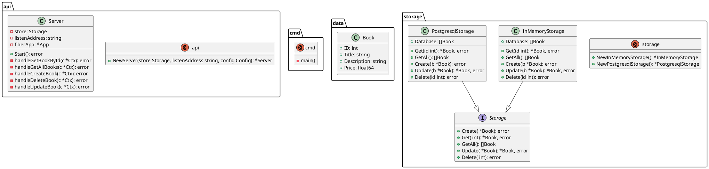

# books-go

A small playground application which consists of a REST API (crud actions) that allows you to create, read, update and delete books.

- [books-go](#books-go)
  - [Repo structure](#repo-structure)
    - [`main.go`](#maingo)
    - [`api/`](#api)
    - [`data/`](#data)
    - [`storage/`](#storage)
    - [`utilities/`](#utilities)
    - [`test.http`](#testhttp)
  - [Overview](#overview)
  - [Usage](#usage)
    - [Running](#running)
  - [TODOs](#todos)
  - [Generating puml](#generating-puml)

## Repo structure

```txt
.
├── README.md
├── api
├── data
├── go.mod
├── go.sum
├── main.go
├── storage
├── test.http
└── utilities
```

### `main.go`

`main.go` is only the firestarter for our application. It does not hold any logic besides starting the server with some bunch of config.

### `api/`

Holds the server logic, including middleware, Fiber handling, route registration and CRUD routes themselves.

### `data/`

Holds data models.

### `storage/`

Interfacing module for persistence. Holds a `InMemoryStorage` for local testing and a (to be implemented) `PostgresqlStorage`.

### `utilities/`

Empty at the moment but might come in handy later for common utility functions / operations.

### `test.http`

Holds some fancy API calls for local testing. Comes in handy when trying to find out if I copulated with API functionality.

## Overview



## Usage

### Running

After installing dependencies using `go get`, you should be able to run the project with `go run cmd/main.go`. The server will start up and be reachable at [`http://localhost:3000`](http://localhost:3000).

See [`test.http`](test.http) for available API endpoints.

## TODOs

- Implement PostgresqlStorage
- Fix updating books
- Write docs!
- Go and see if all those dependencies are "needed" for this small project or can be cleaned up

## Generating puml

Run: `go-plantuml generate -d . -r`
